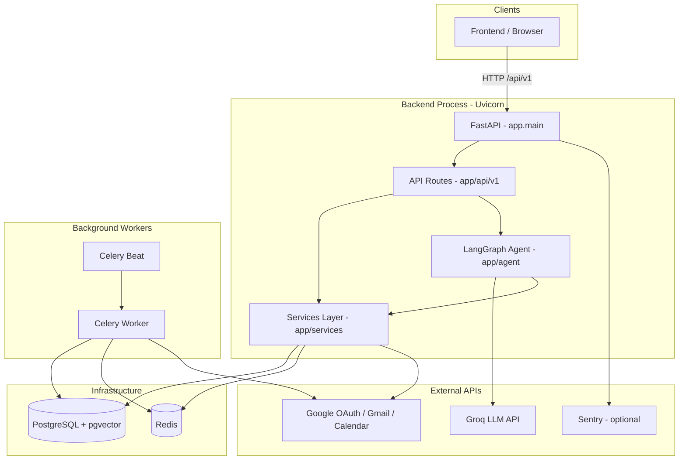
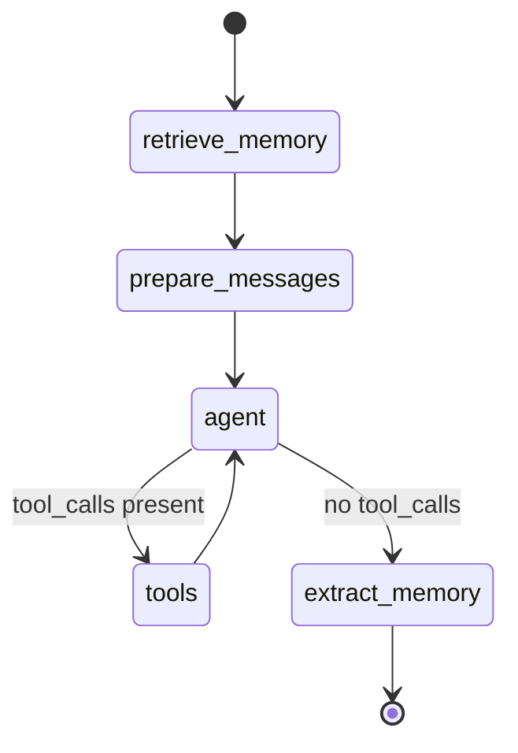
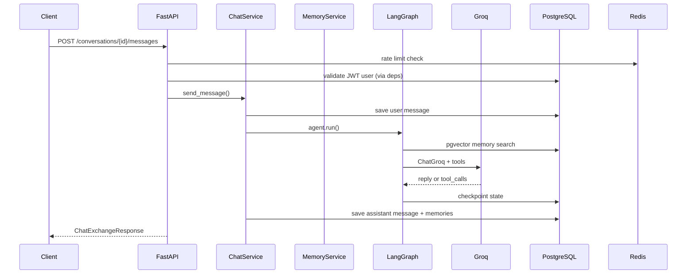

# Backend Architecture

This document describes the Sentellent backend: how the code is organized, what each file does, and which external services the application depends on.

The backend is a **FastAPI** application (v0.4.0) that exposes a versioned REST API at `/api/v1`. It powers a multi-tenant AI chief-of-staff agent with Google Workspace integration (Gmail + Calendar), long-term memory with semantic search, and background email ingestion.

---

## High-level architecture



### Typical request flows

**Authentication**

1. Client calls `GET /api/v1/auth/google/login` → backend returns a Google authorization URL.
2. User signs in with Google → Google redirects to `GET /api/v1/auth/google/callback`.
3. Backend exchanges the code for tokens, creates or updates the user and workspace connection, issues a JWT, and redirects to the frontend with the token.
4. Subsequent requests send `Authorization: Bearer <token>`; `deps.py` validates the JWT and loads the user.

**Chat**

1. Client posts to `POST /api/v1/conversations/{id}/messages`.
2. `ChatService` persists the user message, loads conversation history, and invokes the LangGraph agent.
3. The agent retrieves relevant memories, calls Groq (with optional Gmail/Calendar tools), extracts new memories from the user message, and returns a reply.
4. The assistant message is saved; the API returns both messages plus memory context.

**Email ingestion (background)**

1. Triggered after OAuth callback or via `POST /api/v1/workspace/ingest`.
2. `JobService` creates a `BackgroundJob` record and enqueues `ingest_user_inbox` on Celery.
3. The worker fetches recent Gmail messages, extracts facts, and stores them as memory items with embeddings.

---

## Top-level backend layout

```
backend/
├── alembic/              # Database migrations
├── app/                  # Application source code
│   ├── agent/            # LangGraph chief-of-staff agent
│   ├── api/v1/           # HTTP route handlers
│   ├── core/             # Config, deps, logging, errors, rate limits
│   ├── db/               # SQLAlchemy base, session, mixins
│   ├── models/           # ORM models (database tables)
│   ├── schemas/          # Pydantic request/response models
│   ├── services/         # Business logic
│   └── workers/          # Celery app and background tasks
├── tests/                # Pytest test suite
├── alembic.ini           # Alembic configuration
├── Dockerfile            # Container image for API, worker, and beat
├── pyproject.toml        # Python package definition and dependencies
├── README.md             # Quick start and route summary
└── .env.example          # Environment variable template
```

---

## Folder reference

### `app/` — Application package

The main Python package. Uvicorn loads `app.main:app`. All business logic lives here, organized by concern (HTTP, services, persistence, agent, workers).

### `app/agent/` — AI agent (LangGraph)

Contains the chief-of-staff agent graph, Google Workspace tools exposed to the LLM, and LangGraph checkpoint persistence (conversation state in PostgreSQL).

### `app/api/v1/` — HTTP API layer

FastAPI routers for version 1 of the API. Handlers are thin: they validate input, enforce rate limits, call services, and return Pydantic response models. No heavy business logic in route files.

### `app/core/` — Cross-cutting infrastructure

Configuration (`Settings`), dependency injection (`CurrentUser`, `DbSession`), structured logging, custom exceptions, and Redis-backed rate limiting.

### `app/db/` — Database plumbing

SQLAlchemy declarative base, session factory, and reusable model mixins (`AuditMixin`, `OrganizationScopedMixin`).

### `app/models/` — SQLAlchemy ORM models

One model per primary table. All tenant-scoped tables include `organization_id` for multi-tenancy.

### `app/schemas/` — Pydantic schemas

Request bodies, response DTOs, pagination wrappers, and internal dataclasses for Gmail/Calendar API results.

### `app/services/` — Business logic

Services encapsulate auth, chat, memory, Google APIs, encryption, embeddings, jobs, and organizations. API routes and the agent call into this layer.

### `app/workers/` — Celery background processing

Celery application configuration, email ingestion task, and periodic worker heartbeat for health checks.

### `alembic/` — Database migrations

Alembic revision scripts that evolve the PostgreSQL schema (including pgvector extension and LangGraph-related columns).

### `tests/` — Automated tests

Pytest tests for auth, chat, memory, multitenancy, workers, migrations, and configuration. Uses `conftest.py` for shared fixtures.

---

## File reference — root & config

| File | Purpose |
| --- | --- |
| `pyproject.toml` | Defines the `sentellent-backend` package (v0.4.0), runtime dependencies (FastAPI, SQLAlchemy, LangGraph, Celery, etc.), and dev tools (pytest, ruff, mypy). |
| `Dockerfile` | Python 3.12 slim image: installs dependencies, copies `app/` and `alembic/`, runs `alembic upgrade head` on start, then launches Uvicorn on port 8000. Same image is used for worker and beat with different commands. |
| `alembic.ini` | Alembic logging and script location (`alembic/`). Database URL is resolved from `DATABASE_URL` env var at migration time. |
| `.env.example` | Documents every environment variable with inline comments. Copy to `.env` for local development. |
| `README.md` | Short overview, local run commands, and a table of key API routes. |

---

## File reference — `app/`

### `app/main.py`

Application entry point.

- Calls `create_app()` which builds the FastAPI instance.
- Configures **structlog** based on `APP_ENVIRONMENT`.
- On startup (lifespan): optionally initializes **Sentry**; ensures LangGraph checkpoint tables exist in PostgreSQL.
- Registers **CORS** middleware, **request logging** middleware, and the global `AppError` exception handler.
- Mounts the v1 API router at `/api/v1`.
- Exports `app` for Uvicorn: `uvicorn app.main:app`.

---

## File reference — `app/core/`

| File | Purpose |
| --- | --- |
| `config.py` | `Settings` class (Pydantic Settings) loading from `.env`. Centralizes database URL, Redis, JWT, Google OAuth, Groq models, Celery, CORS, rate limits, embedding dimensions, timezone, and Sentry DSN. Provides computed properties: `sqlalchemy_database_url`, `groq_model_chain`, `cors_origin_list`, `google_scope_list`, Celery broker/backend resolution. Cached via `get_settings()`. |
| `deps.py` | FastAPI dependencies: `DbSession`, `SettingsDep`, `AuthServiceDep`, `CurrentUser`. Decodes JWT from `Authorization: Bearer`, validates `sub` and `org_id` claims, loads user scoped to organization. Binds `user_id` and `organization_id` to `request.state` for logging. `require_organization_scope()` guards cross-tenant access. |
| `exceptions.py` | `AppError` base exception and subclasses (`NotFoundError`, `UnauthorizedError`, `ForbiddenError`, `ConflictError`). `app_error_handler` returns consistent JSON error payloads `{ "error": { "code", "message", "details" } }`. |
| `logging.py` | `configure_structlog()` — JSON logs in production, console renderer in development. `RequestLoggingMiddleware` assigns `X-Request-ID`, logs method, path, status, duration, and tenant context after each request. |
| `rate_limit.py` | `RateLimitService` using **slowapi** / **limits** with Redis storage (falls back to `memory://`). Enforces per-route limits: auth (by IP), chat (by user token or IP), ingest (by user). Raises `AppError` with code `rate_limit_exceeded` on 429. |

---

## File reference — `app/db/`

| File | Purpose |
| --- | --- |
| `base.py` | SQLAlchemy `DeclarativeBase` with a consistent naming convention for indexes, foreign keys, and constraints. |
| `session.py` | Lazy singleton SQLAlchemy engine and session factory. `get_db()` yields a session per request (auto-closed). Supports PostgreSQL (psycopg) and SQLite (tests). `pool_pre_ping=True` for connection health. `reset_session_state()` for tests. |
| `mixins.py` | `utcnow()`, `retention_expiration(days)`, `UUIDPrimaryKey` type alias, `AuditMixin` (`created_at`, `updated_at`), `OrganizationScopedMixin` (`organization_id` FK to `organizations`). |

---

## File reference — `app/models/`

| File | Table | Purpose |
| --- | --- | --- |
| `__init__.py` | — | Re-exports all models for Alembic autogenerate and convenient imports. |
| `organization.py` | `organizations` | Tenant root: `name`, `slug`, `email_domain`, `is_active`. Users are grouped by email domain on first Google sign-in. |
| `user.py` | `users` | Tenant member: `email`, `full_name`, `google_subject`, `role` (`owner` / `member`), `is_active`. Unique per `(organization_id, email)`. |
| `conversation.py` | `conversations` | Chat thread per user: `title`, `summary`, `status`, `expires_at` (retention). Indexed by org + created_at / expires_at. |
| `message.py` | `messages` | Individual chat messages: `role` (`user` / `assistant`), `content`, `sent_at`, optional `external_message_id`. |
| `memory_item.py` | `memory_items` | Long-term memory: `memory_type`, `content`, `source_type`, embeddings (`embedding_vector` JSON + pgvector `embedding` column), visibility, pin/correct/forget timestamps. |
| `workspace_connection.py` | `workspace_connections` | Encrypted Google OAuth tokens per user: `scopes`, `access_token_encrypted`, `refresh_token_encrypted`, `token_expires_at`, `is_connected`. |
| `background_job.py` | `background_jobs` | Async job tracking: `job_type`, `status`, `idempotency_key`, `payload`, `result`, `error_message`, timestamps. |
| `task.py` | `tasks` | Future task/todo entity linked to conversations and users (`title`, `status`, `priority`, `due_at`). Schema exists; not yet exposed via API routes. |

---

## File reference — `app/schemas/`

| File | Purpose |
| --- | --- |
| `common.py` | Base `APIModel`, `ErrorResponse`, `PaginationMeta`, generic `PaginatedResponse[T]`. |
| `api.py` | All public API DTOs: `UserResponse`, `ConversationResponse`, `MessageResponse`, `ChatExchangeResponse`, `MemoryItemResponse`, `OrganizationResponse`, `BackgroundJobResponse`, request types (`SendMessageRequest`, `IngestWorkspaceRequest`, etc.). |
| `health.py` | `HealthResponse` for `/api/v1/health` including dependency check map. |
| `workspace.py` | Internal dataclasses (not Pydantic API models): `EmailSummary`, `CalendarEventSummary`, `CreatedCalendarEvent` — used by Gmail and Calendar services. |

---

## File reference — `app/api/v1/`

| File | Prefix / routes | Purpose |
| --- | --- | --- |
| `router.py` | `/api/v1` | Aggregates all v1 routers: health, auth, org, chat, workspace. |
| `health.py` | `GET /health` | Probes PostgreSQL (`SELECT 1`), Redis ping, and Celery worker heartbeat. Returns `ok`, `degraded`, or `error` with per-check status. |
| `auth.py` | `/auth/*` | Google OAuth login URL, redirect helpers, callback (creates user, stores tokens, enqueues email ingest, redirects to frontend with JWT). `GET /me`, `POST /logout`, `GET /workspace` connection status with scope flags and reconnect hints. |
| `org.py` | `/org` | `GET /org` — current organization details and member count. `GET /org/members` — list members (owners only). |
| `chat.py` | `/conversations`, `/memory` | Full chat CRUD: list/create/delete conversations, list/send messages, list/correct/forget/pin memory items. Rate-limited chat endpoint invokes `ChatService.send_message()`. |
| `workspace.py` | `/workspace/ingest`, `/jobs/{id}` | `POST /workspace/ingest` — enqueue Gmail ingestion (202 Accepted). `GET /jobs/{job_id}` — poll background job status. |

---

## File reference — `app/services/`

| File | Purpose |
| --- | --- |
| `auth.py` | **AuthService** — JWT creation/decoding (python-jose), Redis session storage, Google user provisioning (creates org from email domain on first sign-in), workspace connection upsert with encrypted tokens. |
| `chat.py` | **ChatService** — Conversation and message persistence, pagination helpers, orchestrates agent invocation via `ChiefOfStaffAgent`, persists extracted memories and assistant replies. Deletes LangGraph checkpoints when a conversation is removed. |
| `memory.py` | **MemoryService** — Create/update/search memory with hash-based embeddings. Conflict detection via cosine similarity. pgvector `<=>` search on PostgreSQL; fallback to in-Python similarity. User actions: correct, forget, pin. Rule-based `extract_memories_from_text()` for chat and email. |
| `embeddings.py` | **EmbeddingService** — Deterministic local embeddings (`hash-v1`): tokenizes text, SHA-256 hashing into a normalized 384-dim vector. No external embedding API. |
| `jobs.py` | **JobService** — Creates `BackgroundJob` rows with daily idempotency key (`email_ingest:{user_id}:{date}`), dispatches Celery `ingest_user_inbox`, tracks running/completed/failed state. |
| `organization.py` | **OrganizationService** — Lookup org by ID or email domain, member count, list members, `require_owner()` guard. Helpers: `normalize_email_domain()`, `domain_to_org_slug()`. |
| `google_oauth.py` | **GoogleOAuthService** — Builds Google authorization URL, exchanges auth code for tokens via `oauth2.googleapis.com/token`, fetches userinfo. |
| `google_credentials.py` | **GoogleCredentialsService** — Decrypts stored tokens, refreshes expired access tokens using refresh token, updates DB. |
| `google_scopes.py` | Pure functions to parse and check Gmail/Calendar OAuth scopes (`has_gmail_access`, `has_calendar_read_access`, `has_calendar_write_access`, `missing_calendar_scopes`). |
| `gmail.py` | **GmailService** — Async Gmail REST client (httpx): list recent inbox messages, fetch metadata (subject, from, snippet). Retry on 429. Formats summaries for the agent. |
| `calendar.py` | **CalendarService** — Async Google Calendar v3 client: list events (range or by date), create events with attendees and timezone, delete events. Resolves calendar timezone from user settings. |
| `encryption.py` | **TokenEncryptionService** — Fernet encrypt/decrypt for OAuth tokens at rest. Key derived from `TOKEN_ENCRYPTION_KEY` or `JWT_SECRET_KEY`. |
| `redis_store.py` | **RedisSessionStore** — Session CRUD in Redis with TTL. Falls back to in-memory dict when Redis is unavailable. Also used for generic key/value (worker heartbeat). |
| `timezone_utils.py` | Local datetime parsing/formatting, `ZoneInfo` helpers, day bounds for calendar queries. Default timezone from `DEFAULT_TIMEZONE` (e.g. `Asia/Kolkata`). |

---

## File reference — `app/agent/`

| File | Purpose |
| --- | --- |
| `graph.py` | **ChiefOfStaffAgent** — LangGraph `StateGraph` with nodes: `retrieve_memory` → `prepare_messages` → `agent` ↔ `tools` (loop) → `extract_memory`. Uses **ChatGroq** with model fallback chain on rate limits. System prompt defines chief-of-staff behavior, scheduling rules, and tool usage policy. Checkpoints per conversation thread in PostgreSQL. |
| `tools.py` | **WorkspaceToolContext** and LangChain `StructuredTool` definitions: `fetch_recent_emails`, `list_calendar_events`, `list_calendar_events_for_date`, `create_calendar_event`, `delete_calendar_event`, `delete_calendar_event_by_time`. Validates OAuth scopes, refreshes tokens, writes calendar/email facts to memory. |
| `checkpoint.py` | LangGraph **PostgresSaver** (or `InMemorySaver` for SQLite tests). `ensure_checkpoint_schema()` runs DDL on startup. `build_checkpoint_config()` namespaces checkpoints by org/user/conversation. `delete_conversation_checkpoint()` on conversation delete. |

### Agent graph flow



---

## File reference — `app/workers/`

| File | Purpose |
| --- | --- |
| `celery_app.py` | Celery application named `sentellent`. Broker and result backend default to `REDIS_URL`. Registers task modules. Beat schedule: `worker_heartbeat` every 60 seconds. `CELERY_TASK_ALWAYS_EAGER` runs tasks inline (tests). |
| `tasks/email_ingestion.py` | **`ingest_user_inbox`** Celery task — loads job and user, marks job running, fetches Gmail via `GmailService`, extracts and persists memories, marks job completed or failed. |
| `tasks/maintenance.py` | **`worker_heartbeat`** — writes timestamp to Redis key `worker:heartbeat` (TTL 120s). **`worker_is_alive()`** — used by health endpoint to detect stale workers. |

---

## File reference — `alembic/`

| File | Purpose |
| --- | --- |
| `env.py` | Alembic migration runtime: imports `Base.metadata` and all models, resolves `DATABASE_URL`, runs online/offline migrations. |
| `script.py.mako` | Template for generating new migration files. |
| `versions/0001_initial_schema.py` | Creates core tables: `organizations`, `users`, `conversations`, `messages`, `memory_items`, `tasks`. |
| `versions/0002_workspace_pgvector.py` | Enables PostgreSQL `vector` extension; creates `workspace_connections` table. |
| `versions/0003_phase3_memory.py` | Memory ownership (`owner_user_id`), visibility, pgvector `embedding` column, indexes for semantic search. |
| `versions/0004_phase4_multitenancy.py` | `organizations.email_domain`, `background_jobs` table, multitenancy indexes. |

---

## File reference — `tests/`

| File | Purpose |
| --- | --- |
| `conftest.py` | Shared pytest fixtures: test database, settings overrides, HTTP client, auth helpers. |
| `test_main.py` | App creation and basic wiring. |
| `test_config.py` | Settings loading and computed properties. |
| `test_auth.py` | OAuth flow mocks, JWT, user creation. |
| `test_chat.py` | Conversation and messaging endpoints. |
| `test_memory_phase3.py` | Memory CRUD, search, embeddings. |
| `test_workspace.py` | Workspace connection and ingest endpoints. |
| `test_multitenancy_phase4.py` | Organization scoping and isolation. |
| `test_phase4_worker.py` | Celery email ingestion task. |
| `test_phase4_observability.py` | Health checks and logging. |
| `test_agent_rate_limit.py` | Groq rate-limit fallback behavior. |
| `test_checkpoint.py` | LangGraph checkpoint create/delete. |
| `test_timezone.py` | Timezone parsing for calendar tools. |
| `test_schema.py` | Pydantic schema validation. |
| `test_alembic.py` | Migration upgrade/downgrade smoke tests. |

---

## External and infrastructure services

Every service the backend uses — hosted by you, via Docker, or external.

### Self-hosted / Docker Compose

| Service | Image / tech | Used for |
| --- | --- | --- |
| **PostgreSQL 16 + pgvector** | `pgvector/pgvector:pg16` | Primary database: users, orgs, conversations, messages, memory (with vector column), workspace tokens, background jobs, LangGraph checkpoints. Port `5432`. |
| **Redis 7** | `redis:7-alpine` | JWT session cache, API rate limiting, Celery broker + result backend, worker heartbeat key. Port `6379`. Falls back to in-memory when unreachable (development only). |
| **Backend API** | Custom Dockerfile | FastAPI + Uvicorn on port `8000`. Runs migrations on container start. |
| **Celery Worker** | Same Dockerfile | Executes `ingest_user_inbox` and other async tasks. Command: `celery -A app.workers.celery_app worker`. |
| **Celery Beat** | Same Dockerfile | Periodic scheduler; triggers `worker_heartbeat` every 60s. Command: `celery -A app.workers.celery_app beat`. |

### External APIs (third-party)

| Service | Configuration | Used for |
| --- | --- | --- |
| **Groq** | `GROQ_API_KEY`, `GROQ_MODEL_NAME`, fallbacks | LLM inference for the chief-of-staff agent (tool calling, reasoning). Models tried in order on rate limits. |
| **Google OAuth 2.0** | `GOOGLE_OAUTH_CLIENT_ID`, `GOOGLE_OAUTH_CLIENT_SECRET`, `GOOGLE_OAUTH_REDIRECT_URI` | User sign-in; issues access + refresh tokens. |
| **Gmail API** | OAuth scopes (`gmail.readonly`) | Read inbox messages; source for email-driven memory. |
| **Google Calendar API** | OAuth scopes (`calendar`) | List, create, and delete calendar events. |
| **Sentry** (optional) | `SENTRY_DSN` | Error tracking and performance monitoring in non-dev environments. |
| **AWS S3** (optional) | `S3_UPLOAD_BUCKET_NAME` | Reserved for future file uploads; not required for core chat. |
| **Supabase** (optional hosting) | `DATABASE_URL` with `supabase.co` | Managed PostgreSQL; SSL mode auto-enabled in `database_connect_args`. |

### Python libraries (key dependencies)

The table below is a quick reference. Each library is explained in depth in the next section.

| Library | Role |
| --- | --- |
| **FastAPI** + **Uvicorn** | HTTP server and ASGI runtime. |
| **SQLAlchemy 2** + **psycopg** | ORM and PostgreSQL driver. |
| **Alembic** | Schema migrations. |
| **pgvector** | Vector similarity in PostgreSQL. |
| **LangChain** + **LangGraph** + **langchain-groq** | Agent framework and Groq chat model. |
| **langgraph-checkpoint-postgres** | Persistent agent state per conversation. |
| **Celery** | Distributed task queue. |
| **redis** | Redis client for sessions and rate limits. |
| **httpx** | Async HTTP for Google APIs. |
| **python-jose** | JWT signing and verification. |
| **cryptography** (Fernet) | OAuth token encryption at rest. |
| **slowapi** / **limits** | Rate limiting. |
| **structlog** | Structured JSON logging. |
| **sentry-sdk** | Optional error reporting. |
| **pydantic-settings** | Typed configuration from environment. |

---

## Python libraries — detailed guide

This section explains **what each library does**, **why Sentellent uses it**, and **where it appears in the codebase**.

### FastAPI + Uvicorn

**What they are**

- **FastAPI** is a modern Python web framework for building APIs. It uses Python type hints and Pydantic for automatic request/response validation and OpenAPI documentation.
- **Uvicorn** is an ASGI server that runs the FastAPI application and handles concurrent HTTP connections.

**How Sentellent uses them**

- All HTTP endpoints live under `/api/v1` and are defined with `APIRouter` in `app/api/v1/`.
- FastAPI **dependency injection** (`Depends`) wires database sessions, settings, and the current user into route handlers — see `app/core/deps.py`.
- Pydantic models in `app/schemas/` validate JSON bodies and shape API responses.
- `app/main.py` creates the app, adds CORS and logging middleware, and registers the global error handler.

**Local / Docker command**

```bash
uvicorn app.main:app --reload --host 0.0.0.0 --port 8000
```

**Key files:** `app/main.py`, `app/api/v1/*.py`, `app/core/deps.py`

---

### SQLAlchemy 2 + psycopg

**What they are**

- **SQLAlchemy 2** is an ORM (Object-Relational Mapper). You define Python classes (`models/`) that map to database tables and query them with a high-level API instead of raw SQL.
- **psycopg** (version 3) is the PostgreSQL driver. The connection string uses the `postgresql+psycopg://` dialect so SQLAlchemy talks to Postgres.

**How Sentellent uses them**

- `app/db/base.py` defines the declarative `Base` class and naming conventions for indexes and foreign keys.
- `app/db/session.py` creates a shared engine and `sessionmaker`. Each HTTP request gets its own session via `get_db()` and it is closed when the request ends.
- All tables are modeled in `app/models/` (`User`, `Conversation`, `Message`, `MemoryItem`, etc.).
- Services (`app/services/`) run queries with `select()`, `db.scalar()`, `db.scalars()`, and `db.commit()`.
- Every tenant-scoped row includes `organization_id` through `OrganizationScopedMixin`.

**Example flow**

1. Route handler receives `DbSession` from FastAPI.
2. `ChatService` queries `Conversation` and `Message` filtered by `organization_id` and `user_id`.
3. Changes are committed to PostgreSQL.

**Configuration:** `DATABASE_URL` in `.env` (see `app/core/config.py` → `sqlalchemy_database_url`).

**Key files:** `app/db/`, `app/models/`, all `app/services/*.py`

---

### Alembic

**What it is**

Alembic is a database migration tool for SQLAlchemy. Instead of changing the database by hand, you apply versioned Python scripts that create or alter tables in a repeatable way.

**How Sentellent uses it**

- Migration scripts live in `alembic/versions/`:
  - `0001` — core tables (users, conversations, messages, memory, tasks)
  - `0002` — `workspace_connections` + `CREATE EXTENSION vector`
  - `0003` — memory ownership, visibility, pgvector `embedding` column
  - `0004` — `email_domain` on organizations, `background_jobs` table
- `alembic/env.py` loads all models so Alembic knows the target schema.
- The **Dockerfile** runs `alembic upgrade head` before starting Uvicorn so containers always match the latest schema.

**Commands**

```bash
alembic upgrade head    # apply all pending migrations
alembic current         # show current revision
```

**Key files:** `alembic/`, `alembic.ini`, `Dockerfile`

---

### pgvector

**What it is**

pgvector is a **PostgreSQL extension** that adds a native `vector` column type and operators for similarity search (e.g. cosine distance with `<=>`).

**How Sentellent uses it**

- Enabled in migration `0002_workspace_pgvector.py` via `CREATE EXTENSION IF NOT EXISTS vector`.
- `memory_items` has an `embedding` column (384 dimensions, matching `PGVECTOR_EMBEDDING_DIMENSIONS`).
- `MemoryService.search_relevant_memories()` runs a SQL query ordering by `embedding <=> query_embedding` to find memories semantically close to the user's message.
- Embeddings are produced locally by `EmbeddingService` (`hash-v1`) — no OpenAI/Cohere embedding API. The same vector is also stored in JSON (`embedding_vector`) for portability and tests.

**Why both JSON and pgvector?**

- JSON works on SQLite in tests.
- pgvector gives fast nearest-neighbor search in production PostgreSQL.

**Configuration:** `PGVECTOR_EMBEDDING_DIMENSIONS=384`, `EMBEDDING_MODEL_NAME=hash-v1`

**Key files:** `app/services/memory.py`, `app/services/embeddings.py`, `alembic/versions/0002_*.py`, `0003_*.py`

---

### LangChain + LangGraph + langchain-groq

**What they are**

- **LangChain** provides building blocks for LLM apps: message types, tool definitions, and model integrations.
- **LangGraph** builds **stateful agent graphs** — nodes, edges, and conditional routing (e.g. “call a tool” vs “finish”).
- **langchain-groq** is the Groq provider for LangChain’s `ChatGroq` chat model.

**How Sentellent uses them**

- `app/agent/graph.py` defines `ChiefOfStaffAgent` as a LangGraph `StateGraph`:
  1. **retrieve_memory** — semantic search for relevant facts
  2. **prepare_messages** — system prompt + history + user message
  3. **agent** — `ChatGroq.invoke()` with tools bound
  4. **tools** — Gmail/Calendar actions (if the model requests them)
  5. **extract_memory** — rule-based extraction from the user message
- `ChatGroq` is configured with `GROQ_API_KEY` and `GROQ_MODEL_NAME`. On **rate limits**, the agent tries fallback models from `groq_model_chain`.
- `app/agent/tools.py` wraps Google Workspace operations as LangChain `StructuredTool` instances with Pydantic input schemas (so the LLM gets structured parameters).

**Agent limits (config)**

- `AGENT_MAX_HISTORY_MESSAGES` — how many prior turns are sent to the model
- `AGENT_MAX_TOOL_ROUNDS` — max tool-call loops per user message

**Key files:** `app/agent/graph.py`, `app/agent/tools.py`, `app/services/chat.py`

---

### langgraph-checkpoint-postgres

**What it is**

A LangGraph integration that **persists agent graph state** (checkpoints) in PostgreSQL, so each conversation can resume mid-graph if needed.

**How Sentellent uses it**

- `app/agent/checkpoint.py` creates a `PostgresSaver` backed by a `psycopg_pool.ConnectionPool`.
- On app startup, `ensure_checkpoint_schema()` runs LangGraph’s DDL (separate from Alembic migrations).
- Each conversation uses `thread_id = conversation_id` and a namespace `org/{org_id}/user/{user_id}` so checkpoints are isolated per tenant and user.
- When a conversation is deleted, `delete_conversation_checkpoint()` removes the thread’s checkpoint data.
- In **tests** with SQLite, an `InMemorySaver` is used instead.

**Key files:** `app/agent/checkpoint.py`, `app/main.py` (lifespan), `app/services/chat.py` (delete)

---

### Celery

**What it is**

Celery is a **distributed task queue**. The API enqueues work; separate **worker** processes pick up tasks and run them in the background without blocking HTTP responses.

**How Sentellent uses it**

- `app/workers/celery_app.py` configures the Celery app with Redis as broker and result backend.
- **Main task:** `ingest_user_inbox` (`app/workers/tasks/email_ingestion.py`) — fetches Gmail and writes memory items after OAuth or manual ingest.
- **Scheduled task:** `worker_heartbeat` (`app/workers/tasks/maintenance.py`) — Celery Beat fires this every 60 seconds so `/health` can detect a live worker.
- `JobService.enqueue_email_ingest()` creates a `BackgroundJob` row, then calls `ingest_user_inbox.delay(...)`.
- `CELERY_TASK_ALWAYS_EAGER=true` runs tasks **inline** in the same process (useful for tests).

**Docker services:** `worker` and `beat` in `docker-compose.yml` use the same backend image with different commands.

**Configuration:** `CELERY_BROKER_URL`, `CELERY_RESULT_BACKEND` (default to `REDIS_URL`)

**Key files:** `app/workers/`, `app/services/jobs.py`, `docker-compose.yml`

---

### redis (Python client)

**What it is**

The official Python client for **Redis**, an in-memory key-value store.

**How Sentellent uses it**

Three separate concerns share one Redis instance:

| Use case | Implementation | Redis keys |
| --- | --- | --- |
| **JWT sessions** | `RedisSessionStore` in `app/services/redis_store.py` | `session:{session_id}` with TTL matching JWT expiry |
| **Rate limiting** | `RateLimitService` in `app/core/rate_limit.py` | Managed by `limits` library against Redis |
| **Celery** | Celery broker + result backend | Celery’s internal queues and task results |
| **Worker health** | `worker_heartbeat` task | `worker:heartbeat` (TTL 120s) |

**Fallback behavior:** If Redis is unreachable at startup, `RedisSessionStore` and rate limiting fall back to **in-memory** storage. This is convenient for local dev but not suitable for production multi-instance deployments.

**Configuration:** `REDIS_URL=redis://localhost:6379/0`

**Key files:** `app/services/redis_store.py`, `app/core/rate_limit.py`, `app/services/auth.py`

---

### httpx

**What it is**

A modern **async HTTP client** for Python (similar to `requests`, but with `async`/`await` support).

**How Sentellent uses it**

All outbound calls to Google use httpx with short-lived `AsyncClient` instances:

| Service | Endpoints |
| --- | --- |
| `GoogleOAuthService` | `oauth2.googleapis.com/token`, Google userinfo |
| `GoogleCredentialsService` | Token refresh |
| `GmailService` | `gmail.googleapis.com/gmail/v1/...` |
| `CalendarService` | `googleapis.com/calendar/v3/...` |

Retries are implemented for Gmail/Calendar on **429** (rate limit) responses. OAuth and API calls use Bearer tokens from stored (encrypted) Google credentials.

**Key files:** `app/services/google_oauth.py`, `google_credentials.py`, `gmail.py`, `calendar.py`

---

### python-jose

**What it is**

A library for creating and verifying **JWTs** (JSON Web Tokens) — compact, signed tokens that carry claims like user ID and organization ID.

**How Sentellent uses it**

- `AuthService.create_access_token()` signs a JWT with `JWT_SECRET_KEY` and algorithm `HS256`.
- Claims include: `sub` (user id), `org_id`, `email`, `sid` (session id), `exp`.
- `get_current_user()` in `deps.py` decodes the Bearer token and loads the user from the database.
- Logout revokes the session in Redis using the `sid` claim (token blacklist is session-based, not a full JWT denylist).

**Configuration:** `JWT_SECRET_KEY`, `JWT_ACCESS_TOKEN_EXPIRES_MINUTES`

**Key files:** `app/services/auth.py`, `app/core/deps.py`, `app/api/v1/auth.py`

---

### cryptography (Fernet)

**What it is**

The **cryptography** package provides Fernet — symmetric encryption (AES-based) for storing secrets at rest.

**How Sentellent uses it**

- `TokenEncryptionService` in `app/services/encryption.py` encrypts Google **access** and **refresh** tokens before saving them in `workspace_connections.access_token_encrypted` and `refresh_token_encrypted`.
- The encryption key is derived from `TOKEN_ENCRYPTION_KEY` (or falls back to `JWT_SECRET_KEY`).
- When Gmail or Calendar tools run, `GoogleCredentialsService` decrypts tokens, refreshes if expired, and re-encrypts the new access token.

This means a database leak does not immediately expose usable Google tokens without the encryption key.

**Configuration:** `TOKEN_ENCRYPTION_KEY`, `ENCRYPT_SENSITIVE_DATA_AT_REST`

**Key files:** `app/services/encryption.py`, `app/services/auth.py`, `app/services/google_credentials.py`

---

### slowapi / limits

**What they are**

- **limits** implements rate-limit algorithms (e.g. “20 per minute”) with pluggable storage (Redis or memory).
- **slowapi** is a FastAPI-oriented wrapper; Sentellent uses `limits` directly via `RateLimitService` rather than slowapi decorators everywhere.

**How Sentellent uses them**

| Endpoint area | Limit key | Default |
| --- | --- | --- |
| Google login | `auth:{client_ip}` | 10/minute |
| Chat messages | `chat:{user_token_or_ip}` | 20/minute |
| Email ingest | `ingest:{user_token_or_ip}` | 5/hour |

Exceeded limits return HTTP **429** with error code `rate_limit_exceeded`.

**Configuration:** `RATE_LIMIT_AUTH_PER_MINUTE`, `RATE_LIMIT_CHAT_PER_MINUTE`, `RATE_LIMIT_INGEST_PER_HOUR`

**Key files:** `app/core/rate_limit.py`, `app/api/v1/auth.py`, `chat.py`, `workspace.py`

---

### structlog

**What it is**

**structlog** produces **structured logs** — each log line is a JSON object with consistent fields instead of unstructured text.

**How Sentellent uses it**

- `configure_structlog()` in `app/core/logging.py` sets up processors: timestamp, log level, request context.
- In **development**, logs render as human-readable console output.
- In **production**, logs render as **JSON** (easy to ship to CloudWatch, Datadog, etc.).
- `RequestLoggingMiddleware` logs every HTTP request with `request_id`, `method`, `path`, `status_code`, `duration_ms`, `user_id`, and `organization_id`.
- Response includes `X-Request-ID` header for correlation with client-side errors.

**Key files:** `app/core/logging.py`, `app/main.py`

---

### sentry-sdk

**What it is**

**Sentry** is an error monitoring platform. **sentry-sdk** captures unhandled exceptions and sends them to your Sentry project with stack traces and environment tags.

**How Sentellent uses it**

- If `SENTRY_DSN` is set, `app/main.py` calls `sentry_sdk.init()` during application lifespan startup.
- The FastAPI integration (from `sentry-sdk[fastapi]`) automatically reports server errors.
- When `SENTRY_DSN` is empty (typical local dev), Sentry is not initialized.

**Configuration:** `SENTRY_DSN`, `APP_ENVIRONMENT` (passed as Sentry environment tag)

**Key files:** `app/main.py`

---

### pydantic-settings

**What it is**

An extension of **Pydantic** for loading and validating **settings from environment variables** and `.env` files.

**How Sentellent uses it**

- `Settings` in `app/core/config.py` declares every config field with types, defaults, and `Field()` descriptions.
- `get_settings()` is cached (`lru_cache`) so the `.env` file is read once per process.
- Computed properties derive values used across the app:
  - `sqlalchemy_database_url` — normalizes `postgresql://` to `postgresql+psycopg://`
  - `groq_model_chain` — ordered list of LLM models for fallback
  - `cors_origin_list` — splits comma-separated origins
  - `celery_broker_url_resolved` — falls back to Redis URL

Almost every service receives `Settings` via `SettingsDep` or `get_settings()`.

**Key files:** `app/core/config.py`, `.env.example`

---

### How the libraries work together (chat example)



---

## Multi-tenancy model

Sentellent uses **shared PostgreSQL with tenant-scoped rows**:

- Every user belongs to one `Organization` (auto-created from email domain on first sign-in).
- Tenant-scoped tables include `organization_id` via `OrganizationScopedMixin`.
- JWT carries `org_id`; all queries filter by `organization_id` and `user_id` where appropriate.
- Memory visibility supports `private`, `organization`, and `promoted` levels.
- Health endpoint reports `tenant_model: shared_postgres_tenant_scoped`.

---

## Security summary

| Concern | Implementation |
| --- | --- |
| Authentication | Google OAuth + JWT (`HS256`, `JWT_SECRET_KEY`). |
| Session revocation | Redis session keyed by `sid` claim; deleted on logout. |
| Token storage | Google access/refresh tokens encrypted with Fernet (`TOKEN_ENCRYPTION_KEY`). |
| Rate limiting | Redis-backed moving window: auth, chat, ingest endpoints. |
| CORS | Configurable `CORS_ORIGINS`; credentials allowed. |
| Tenant isolation | `organization_id` on queries; `require_organization_scope()` helper. |

---

## Related documentation

- [setup.md](./setup.md) — How to run all services locally or in Docker.
- [google-oauth-setup.md](./google-oauth-setup.md) — Google Cloud OAuth client configuration.
- [environment-variables.md](./environment-variables.md) — Full environment variable reference.
- [backend/README.md](../backend/README.md) — Quick start commands and route table.
